``` r
setwd("C:/Users/User/Desktop/Άγγελος/Μουσικών σπουδών")
data<-read.csv("Grades.csv",sep=";",header = TRUE)
data<-data[,-9] #Remove the last X column
data<-data[complete.cases(data), ] #Remove rows with NA's

data$Βαθμός<-as.numeric(data$Βαθμός)
mean(data$Βαθμός) # Grades mean 
```

    ## [1] 7.59375

``` r
median(data$Βαθμός) # Grades median 
```

    ## [1] 7

``` r
data$ΕΤΟΣ<-as.factor(data$ΕΤΟΣ)
summary(data$ΕΤΟΣ)
```

    ## 2016 2017 2018 2019 2020 
    ##    4    7    3   13    5

``` r
plot(data$ΕΤΟΣ,xlab="Έτος",ylab="Αριθμός μαθήματων",main="Μαθήματα ανα έτος",col=c("green","brown"))


library(ggplot2)
```

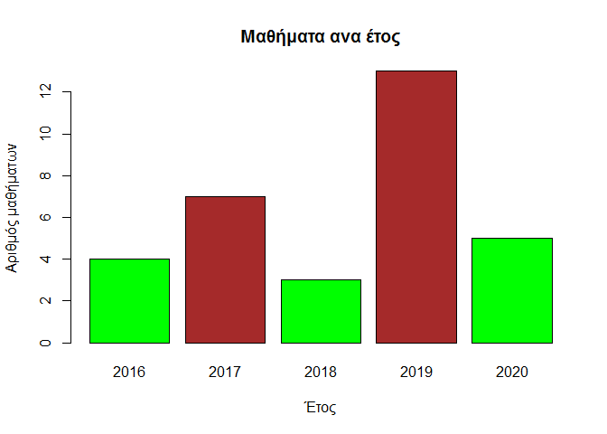

``` r
ggplot(data, aes(x = factor(ΕΤΟΣ),fill=ΕΤΟΣ)) +  
  geom_bar(aes(y = (..count..))) +
  geom_text(stat='count', aes(label=..count..), vjust=-.3) +
  labs(title='Πλήθος Μαθημάτων ανα έτος', x='',y='Πλήθος')+
  theme(plot.title = element_text(hjust = 0.5),legend.position = "None")
```

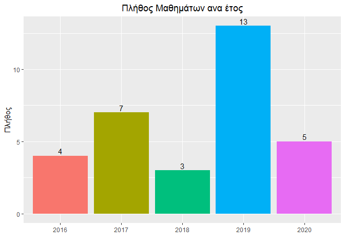

``` r
data$Εξάμηνο<-as.factor(data$Εξάμηνο)
summary(data$Εξάμηνο)
```

    ## 1 2 3 4 5 7 8 
    ## 6 7 3 5 4 5 2

``` r
plot(data$Εξάμηνο,xlab="Εξάμηνο",ylab="Αριθμός μαθήματων",main="Μαθήματα ανα εξάμηνο",col=c("blue","red"))
```

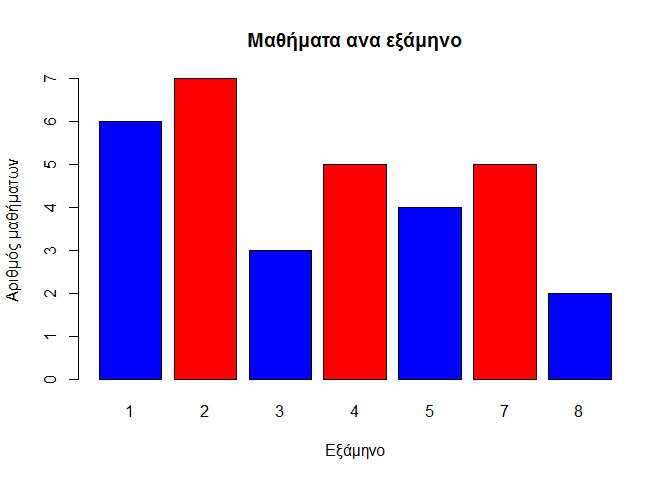

``` r
ggplot(data, aes(x = factor(Εξάμηνο),fill=Εξάμηνο)) +  
  geom_bar(aes(y = (..count..))) +
  geom_text(stat='count', aes(label=..count..), vjust=-.3) +
  labs(title='Πλήθος Μαθημάτων κάθε εξαμήνου', x='Εξάμηνο',y='Πλήθος')+
  theme(plot.title = element_text(hjust = 0.5),legend.position = "None")
```

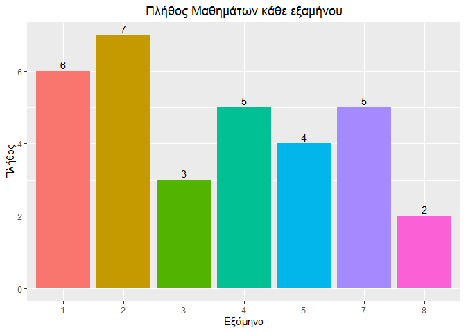

``` r
data$Περίοδος <- droplevels(data$Περίοδος)
summary(data$Περίοδος)
```

    ##      ΕΑΡΙΝΟ ΕΙΣΑΓΩΓΙΚΕΣ ΣΕΠΤΕΜΒΡΙΟΥ   ΧΕΙΜΕΡΙΝΟ 
    ##          12           1           3          16

``` r
levels(data$Περίοδος)
```

    ## [1] "ΕΑΡΙΝΟ"      "ΕΙΣΑΓΩΓΙΚΕΣ" "ΣΕΠΤΕΜΒΡΙΟΥ" "ΧΕΙΜΕΡΙΝΟ"

``` r
plot(data$Περίοδος)
```

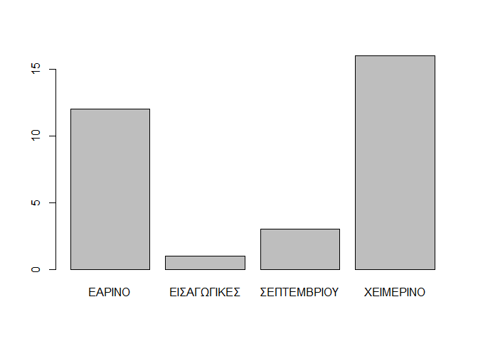

``` r
ggplot(data, aes(x = factor(Περίοδος),fill=Περίοδος)) +  
  geom_bar(aes(y = (..count..))) +
  geom_text(stat='count', aes(label=..count..), vjust=-.3) +
  labs(title='Πλήθος Μαθημάτων ανα εξεταστική περίοδο', x='Εξάμηνο',y='Πλήθος')+
  theme(plot.title = element_text(hjust = 0.5),legend.position = "None")
```

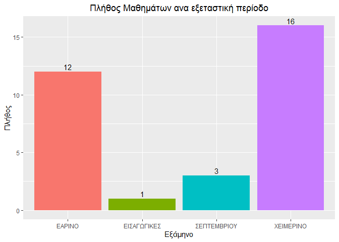

``` r
plot(data$ΕΤΟΣ,data$Βαθμός)
```

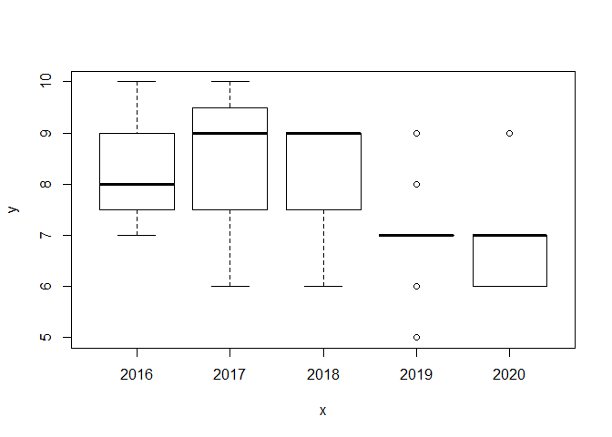

``` r
ggplot(data, aes(x=ΕΤΟΣ, y=Βαθμός, fill=ΕΤΟΣ)) +
  geom_boxplot()
```

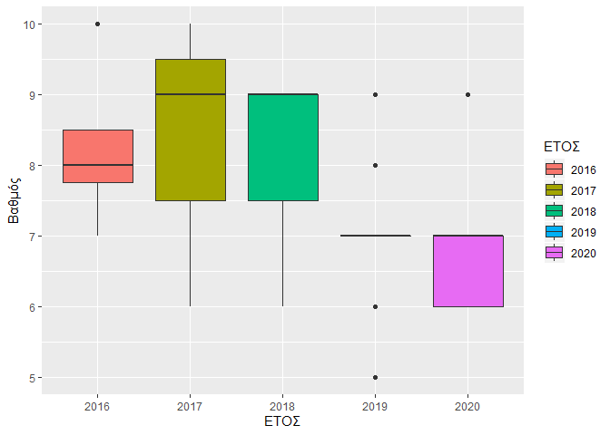

``` r
table(data$ΕΤΟΣ,data$Βαθμός)
```

    ##       
    ##        5 6 7 8 9 10
    ##   2016 0 0 1 2 0  1
    ##   2017 0 1 1 1 2  2
    ##   2018 0 1 0 0 2  0
    ##   2019 1 1 8 2 1  0
    ##   2020 0 2 2 0 1  0

``` r
ggplot(data, aes(x=Περίοδος, y=Βαθμός, fill=Περίοδος)) +
  geom_boxplot()
```

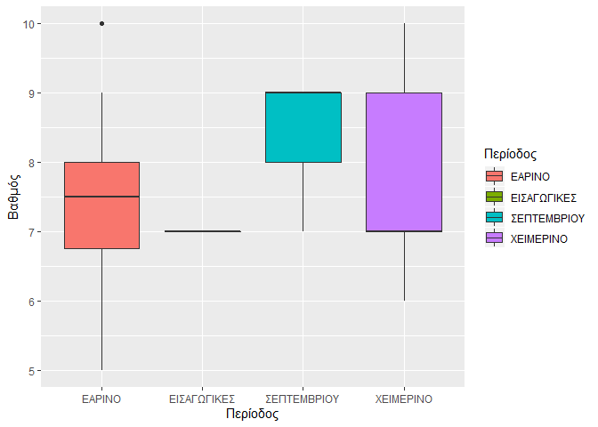

``` r
table(data$Περίοδος,data$Βαθμός)
```

    ##              
    ##               5 6 7 8 9 10
    ##   ΕΑΡΙΝΟ      1 2 3 4 1  1
    ##   ΕΙΣΑΓΩΓΙΚΕΣ 0 0 1 0 0  0
    ##   ΣΕΠΤΕΜΒΡΙΟΥ 0 0 1 0 2  0
    ##   ΧΕΙΜΕΡΙΝΟ   0 3 7 1 3  2

``` r
table(data$Βαθμός)
```

    ## 
    ##  5  6  7  8  9 10 
    ##  1  5 12  5  6  3

``` r
ggplot(data, aes(x = factor(Βαθμός),fill=factor(Βαθμός))) +  
  geom_bar() +
  geom_text(stat='count', aes(label=..count..), vjust=-.3) +
  labs(title='Πλήθος Μαθημάτων ανα βαθμολογία', x='Βαθμός',y='Πλήθος')+
  theme(plot.title = element_text(hjust = 0.5),legend.position = "None")
```

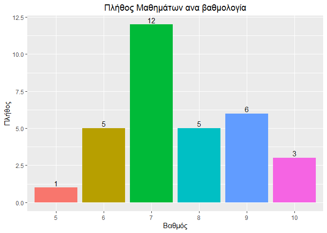

``` r
ggplot(data, aes(x = factor(Βαθμός))) +  
  geom_bar(aes(y = (..count..)/sum(..count..), fill = factor(Βαθμός))) + 
  geom_text(aes( label = scales::percent((..count..)/sum(..count..)),
                 y=(..count..)/sum(..count..) ), stat= "count", vjust =-.3)+
  labs(title='Ποσοστό Μαθημάτων ανα βαθμολογία', x='Βαθμός',y='Ποσοστό')+
  theme(plot.title = element_text(hjust = 0.5),legend.position="none")
```

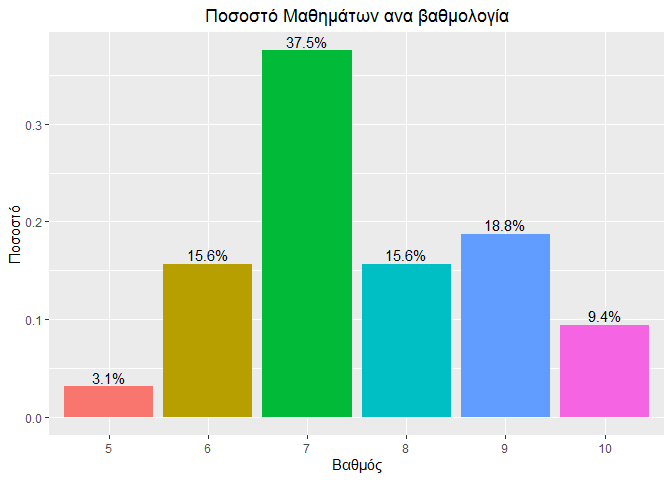

``` r
ggplot(data, aes(x = factor(Βαθμός),fill=factor(Βαθμός))) +  
  geom_bar() +
  geom_text(stat='count', aes(label=..count..), vjust=-.3) +
  labs(title='Πλήθος Μαθημάτων ανα βαθμολογία', x='Βαθμός',y='Πλήθος')+
  theme(plot.title = element_text(hjust = 0.5),legend.position = "None")+
  facet_wrap(~factor(ΕΤΟΣ))
```

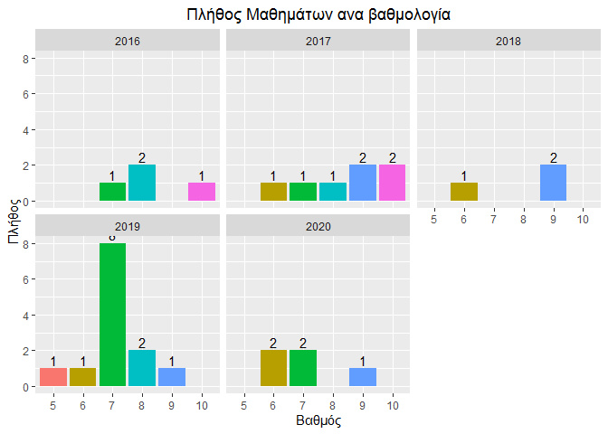

``` r
data$Βαρύτητα <- c(rep(1,nrow(data))) #sintelestis varititas
str(data)
```

    ## 'data.frame':    32 obs. of  9 variables:
    ##  $ No.              : int  1 2 3 4 5 6 7 8 9 10 ...
    ##  $ Περίοδος         : Factor w/ 4 levels "ΕΑΡΙΝΟ","ΕΙΣΑΓΩΓΙΚΕΣ",..: 1 1 1 2 4 4 4 1 1 1 ...
    ##  $ ΕΤΟΣ             : Factor w/ 5 levels "2016","2017",..: 1 1 1 1 2 2 2 2 2 2 ...
    ##  $ Κωδικός.μαθήματος: Factor w/ 34 levels "","69Μ199","69Μ200",..: 22 17 31 30 13 26 32 15 23 14 ...
    ##  $ Μάθημα           : Factor w/ 34 levels "","ΑΙΣΘΗΤΙΚΗ ΚΑΙ ΦΙΛΟΣΟΦΙΑ ΤΗΣ ΜΟΥΣΙΚΗΣ ",..: 28 11 12 17 31 6 23 7 15 32 ...
    ##  $ Εξάμηνο          : Factor w/ 7 levels "1","2","3","4",..: 2 4 4 2 1 1 3 2 2 2 ...
    ##  $ Βαθμός           : num  8 10 8 7 9 10 10 6 8 9 ...
    ##  $ Βαθμός.Ολογράφως : Factor w/ 8 levels "","ΔΕΚΑ","ΕΝΝΕΑ",..: 7 2 7 6 3 2 2 4 7 3 ...
    ##  $ Βαρύτητα         : num  1 1 1 1 1 1 1 1 1 1 ...

``` r
sum(data$Βαρύτητα * data$Βαθμός)/nrow(data) #vathmos ipologismenos me sintelesti varititas
```

    ## [1] 7.59375

``` r
data$Κατηγορία[c(32)]<- c("ΣΕΜΙΝΑΡΙΟ")
data$Κατηγορία[c(30)]<- c("ΕΠΙΛ.ΚΑΤΕΥΘΥΝΣΗΣ")
data$Κατηγορία[c(1:16,21:24,27)] <- c("ΥΠΟΧΡΕΩΤΙΚΟ")
data$Κατηγορία[c(17:20,25,26,28,29,31)]<- c("ΥΠ.ΚΑΤΕΥΘΥΝΣΗΣ")

data$Κατηγορία <-as.factor(data$Κατηγορία)
summary(data$Κατηγορία)
```

    ## ΕΠΙΛ.ΚΑΤΕΥΘΥΝΣΗΣ        ΣΕΜΙΝΑΡΙΟ   ΥΠ.ΚΑΤΕΥΘΥΝΣΗΣ      ΥΠΟΧΡΕΩΤΙΚΟ 
    ##                1                1                9               21

``` r
plot(data$Κατηγορία,xlab="Κατηγορία",ylab="Αριθμός μαθήματων",main="Μαθήματα ανα κατηγορία",col=c("blue","red"))
```

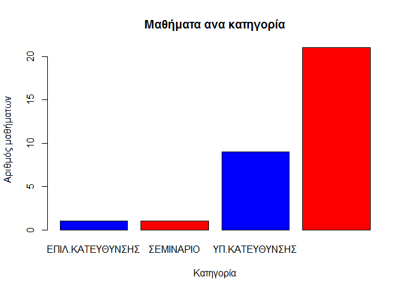

``` r
ggplot(data, aes(x = factor(Κατηγορία),fill=Κατηγορία)) +  
  geom_bar(aes(y = (..count..))) +
  geom_text(stat='count', aes(label=..count..), vjust=-.3) +
  labs(title='Πλήθος Μαθημάτων ανα κατηγορία', x='',y='Πλήθος')+
  theme(plot.title = element_text(hjust = 0.5),legend.position = "None" )
```

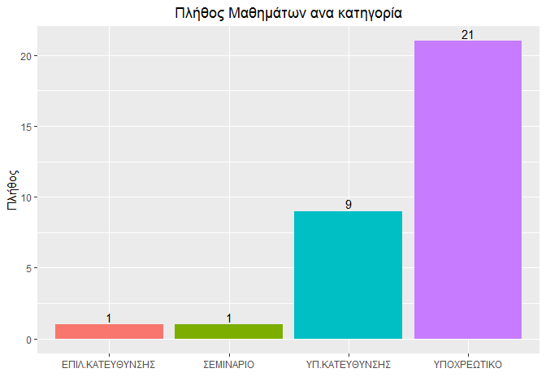

``` r
library(dplyr)
```

    ## 
    ## Attaching package: 'dplyr'

    ## The following objects are masked from 'package:stats':
    ## 
    ##     filter, lag

    ## The following objects are masked from 'package:base':
    ## 
    ##     intersect, setdiff, setequal, union

``` r
Grades<-data.frame(data %>%
                     group_by(ΕΤΟΣ) %>%
                     summarise(round(mean(Βαθμός),2)))
names(Grades)<-c("ΕΤΟΣ","Μ.Ο.")

tapply(data$Βαθμός,data$ΕΤΟΣ,FUN=mean)
```

    ##     2016     2017     2018     2019     2020 
    ## 8.250000 8.428571 8.000000 7.076923 7.000000

``` r
plot(tapply(data$Βαθμός,data$ΕΤΟΣ,FUN=mean),ylim = c(5,10),type='b',xaxt='n',ylab="Βαθμός(Μ.Ο.)",xlab="Έτος",main="Μ.Ο. Μαθημάτων ανα Έτος")
text(Grades[,"ΕΤΟΣ"],Grades[,"Μ.Ο."],label=Grades[,"Μ.Ο."],col='blue',cex=.8,pos = 3)
axis(1, at=1:5, labels=levels(data$ΕΤΟΣ), cex.axis=1)
```

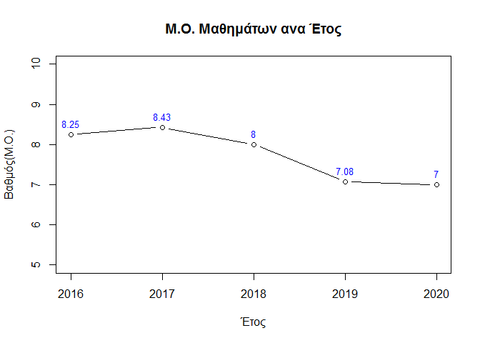

``` r
GradesΚατηγορία<-data.frame(data %>%
                     group_by(Κατηγορία) %>%
                     summarise(round(mean(Βαθμός),2)))
names(GradesΚατηγορία)<-c("Κατηγορία","Μ.Ο.")

tapply(data$Βαθμός,data$Κατηγορία,FUN=mean)
```

    ## ΕΠΙΛ.ΚΑΤΕΥΘΥΝΣΗΣ        ΣΕΜΙΝΑΡΙΟ   ΥΠ.ΚΑΤΕΥΘΥΝΣΗΣ      ΥΠΟΧΡΕΩΤΙΚΟ 
    ##         7.000000         6.000000         7.222222         7.857143

``` r
plot(tapply(data$Βαθμός,data$Κατηγορία,FUN=mean),ylim = c(5,10),type='b',xaxt='n',ylab="Βαθμός(Μ.Ο.)",xlab="Κατηγορία",main="Μ.Ο. Μαθημάτων ανα Κατηγορία")
text(GradesΚατηγορία[,"Κατηγορία"],GradesΚατηγορία[,"Μ.Ο."],label=GradesΚατηγορία[,"Μ.Ο."],col='blue',cex=.8,pos = 3)
axis(1, at=1:4, labels=levels(data$Κατηγορία), cex.axis=0.8)
```

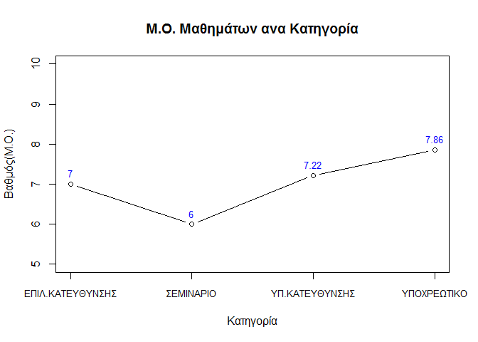

``` r
GradesΠερίοδος<-data.frame(data %>%
                              group_by(Περίοδος) %>%
                              summarise(round(mean(Βαθμός),2)))
names(GradesΠερίοδος)<-c("Περίοδος","Μ.Ο.")

tapply(data$Βαθμός,data$Περίοδος,FUN=mean)
```

    ##      ΕΑΡΙΝΟ ΕΙΣΑΓΩΓΙΚΕΣ ΣΕΠΤΕΜΒΡΙΟΥ   ΧΕΙΜΕΡΙΝΟ 
    ##    7.416667    7.000000    8.333333    7.625000

``` r
plot(tapply(data$Βαθμός,data$Περίοδος,FUN=mean),ylim = c(5,10),type='b',xaxt='n',ylab="Βαθμός(Μ.Ο.)",xlab="Περίοδος",main="Μ.Ο. Μαθημάτων ανα Περίοδο")
text(GradesΠερίοδος[,"Περίοδος"],GradesΠερίοδος[,"Μ.Ο."],label=GradesΠερίοδος[,"Μ.Ο."],col='blue',cex=.8,pos = 3)
axis(1, at=1:4, labels=levels(data$Περίοδος), cex.axis=0.8)
```

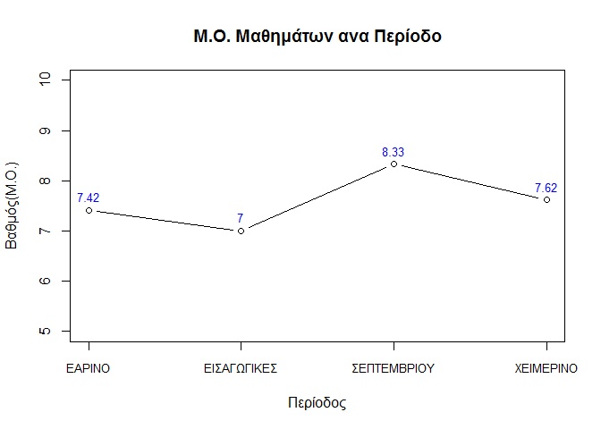

``` r
GradesΕξάμηνο<-data.frame(data %>%
                             group_by(Εξάμηνο) %>%
                             summarise(round(mean(Βαθμός),2)))
names(GradesΕξάμηνο)<-c("Εξάμηνο","Μ.Ο.")

tapply(data$Βαθμός,data$Εξάμηνο,FUN=mean)
```

    ##        1        2        3        4        5        7        8 
    ## 8.000000 7.000000 8.666667 8.400000 7.750000 6.600000 7.000000

``` r
plot(tapply(data$Βαθμός,data$Εξάμηνο,FUN=mean),ylim = c(5,10),type='b',xaxt='n',ylab="Βαθμός(Μ.Ο.)",xlab="Εξάμηνο",main="Μ.Ο. Μαθημάτων Εξαμήνου")
text(GradesΕξάμηνο[,"Εξάμηνο"],GradesΕξάμηνο[,"Μ.Ο."],label=GradesΕξάμηνο[,"Μ.Ο."],col='blue',cex=.8,pos = 3)
axis(1, at=1:7, labels=levels(data$Εξάμηνο), cex.axis=0.8)
```


``` r
paste("Απομένουν ακόμα",52-nrow(data),"μαθήματα για πτυχίο!")
```

    ## [1] "Απομένουν ακόμα 20 μαθήματα για πτυχίο!"

``` r
paste("Ο Γενικός Μέσος Όρος είναι",mean(data$Βαθμός))
```

    ## [1] "Ο Γενικός Μέσος Όρος είναι 7.59375"
