### First we clean the data a bit and have a look at some statistics

    ## [1] 7.59375

    ## [1] 7

    ## 2016 2017 2018 2019 2020 
    ##    4    7    3   13    5

### Next, we will plot the number of lessons we have successfully passed, each year:

    ## 1 2 3 4 5 7 8 
    ## 6 7 3 5 4 5 2

### Then, we will find the number of lessons we have successfully passed, according to the semester they belong to.

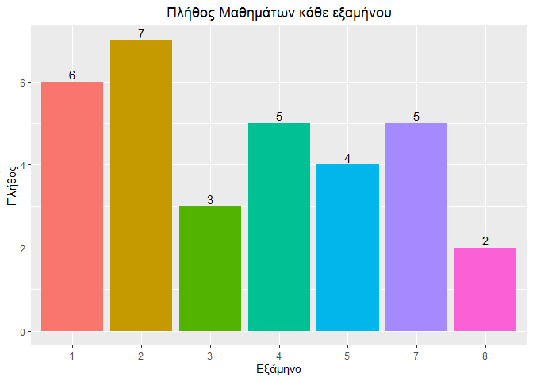

    ##      ΕΑΡΙΝΟ ΕΙΣΑΓΩΓΙΚΕΣ ΣΕΠΤΕΜΒΡΙΟΥ   ΧΕΙΜΕΡΙΝΟ 
    ##          12           1           3          16

### Below is the number of lessons per exam period:

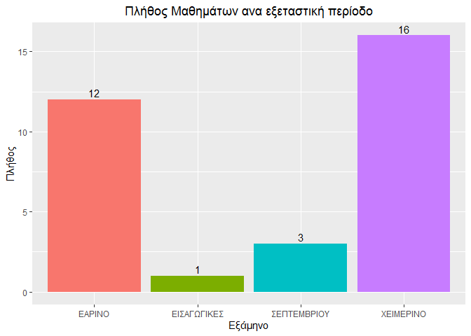

### We can also make some boxplots and tables regarding the grades for each year, and for each period:

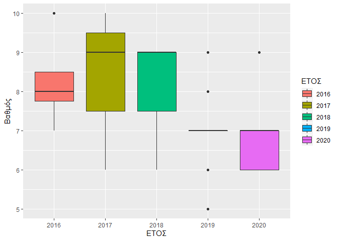

    ##       
    ##        5 6 7 8 9 10
    ##   2016 0 0 1 2 0  1
    ##   2017 0 1 1 1 2  2
    ##   2018 0 1 0 0 2  0
    ##   2019 1 1 8 2 1  0
    ##   2020 0 2 2 0 1  0

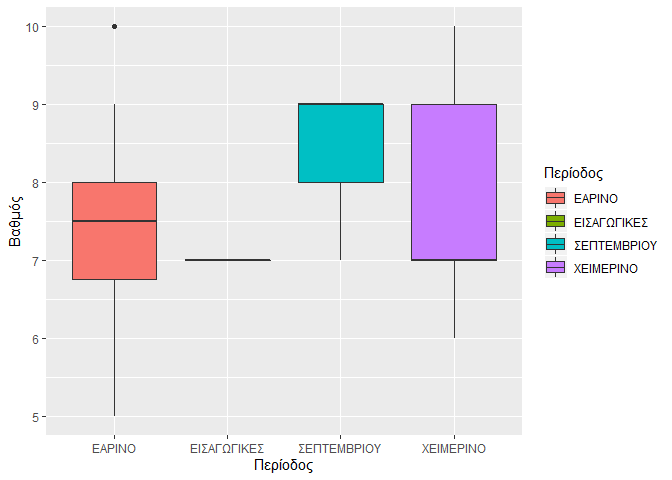

    ##              
    ##               5 6 7 8 9 10
    ##   ΕΑΡΙΝΟ      1 2 3 4 1  1
    ##   ΕΙΣΑΓΩΓΙΚΕΣ 0 0 1 0 0  0
    ##   ΣΕΠΤΕΜΒΡΙΟΥ 0 0 1 0 2  0
    ##   ΧΕΙΜΕΡΙΝΟ   0 3 7 1 3  2

### Below is the number and percentage of lessons per grade:

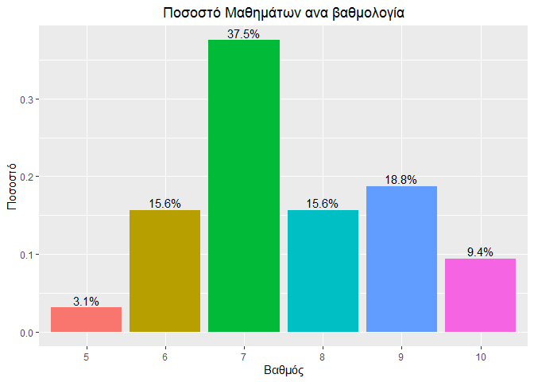

### Next, we have the same plot divided by each year:

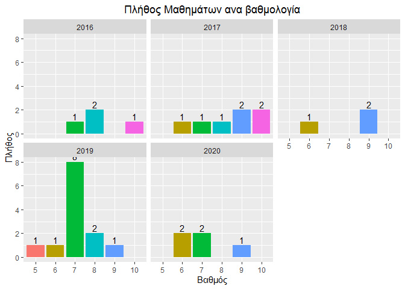

    ## 'data.frame':    32 obs. of  9 variables:
    ##  $ No.              : int  1 2 3 4 5 6 7 8 9 10 ...
    ##  $ Περίοδος         : Factor w/ 4 levels "ΕΑΡΙΝΟ","ΕΙΣΑΓΩΓΙΚΕΣ",..: 1 1 1 2 4 4 4 1 1 1 ...
    ##  $ ΕΤΟΣ             : Factor w/ 5 levels "2016","2017",..: 1 1 1 1 2 2 2 2 2 2 ...
    ##  $ Κωδικός.μαθήματος: Factor w/ 34 levels "","69Μ199","69Μ200",..: 22 17 31 30 13 26 32 15 23 14 ...
    ##  $ Μάθημα           : Factor w/ 34 levels "","ΑΙΣΘΗΤΙΚΗ ΚΑΙ ΦΙΛΟΣΟΦΙΑ ΤΗΣ ΜΟΥΣΙΚΗΣ ",..: 28 11 12 17 31 6 23 7 15 32 ...
    ##  $ Εξάμηνο          : Factor w/ 7 levels "1","2","3","4",..: 2 4 4 2 1 1 3 2 2 2 ...
    ##  $ Βαθμός           : num  8 10 8 7 9 10 10 6 8 9 ...
    ##  $ Βαθμός.Ολογράφως : Factor w/ 8 levels "","ΔΕΚΑ","ΕΝΝΕΑ",..: 7 2 7 6 3 2 2 4 7 3 ...
    ##  $ Βαρύτητα         : num  1 1 1 1 1 1 1 1 1 1 ...

    ## [1] 7.59375

### Now we will create a new column describing the category of the lessons (obligatory etc.) and then plot the number of lessons per category.

    ## ΕΠΙΛ.ΚΑΤΕΥΘΥΝΣΗΣ        ΣΕΜΙΝΑΡΙΟ   ΥΠ.ΚΑΤΕΥΘΥΝΣΗΣ      ΥΠΟΧΡΕΩΤΙΚΟ 
    ##                1                1                9               21

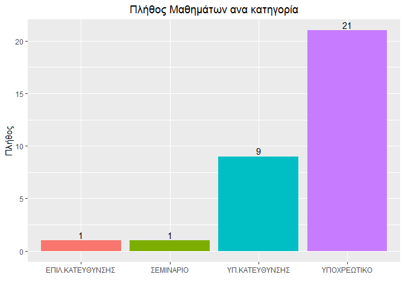

### Now we will create some graphs showing our mean grade for each year.

    ##     2016     2017     2018     2019     2020 
    ## 8.250000 8.428571 8.000000 7.076923 7.000000

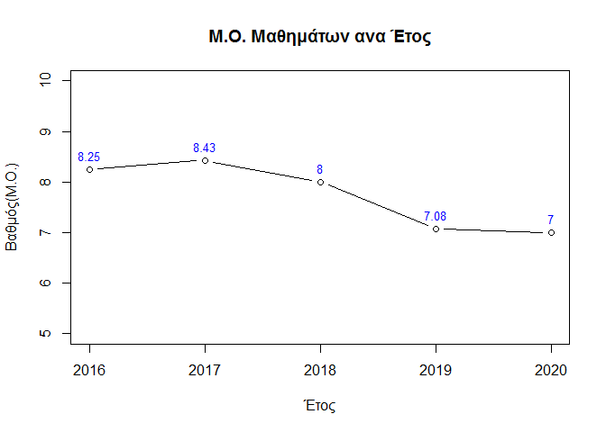

### Then, we do the same but this time for each category:

    ## ΕΠΙΛ.ΚΑΤΕΥΘΥΝΣΗΣ        ΣΕΜΙΝΑΡΙΟ   ΥΠ.ΚΑΤΕΥΘΥΝΣΗΣ      ΥΠΟΧΡΕΩΤΙΚΟ 
    ##         7.000000         6.000000         7.222222         7.857143

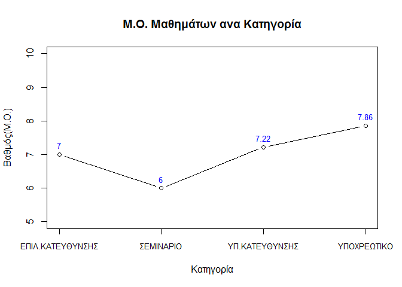

### Now for each exam period:

    ##      ΕΑΡΙΝΟ ΕΙΣΑΓΩΓΙΚΕΣ ΣΕΠΤΕΜΒΡΙΟΥ   ΧΕΙΜΕΡΙΝΟ 
    ##    7.416667    7.000000    8.333333    7.625000

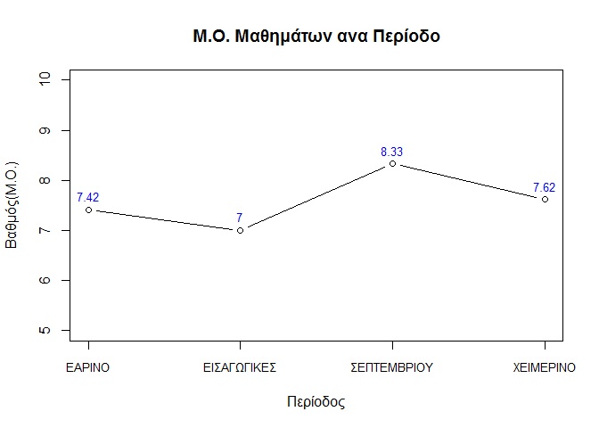

### Finally, the same for each semester:

    ##        1        2        3        4        5        7        8 
    ## 8.000000 7.000000 8.666667 8.400000 7.750000 6.600000 7.000000

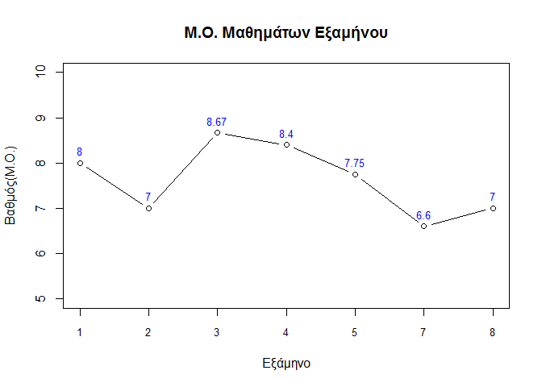

    ## [1] "Απομένουν ακόμα 20 μαθήματα για πτυχίο!"

    ## [1] "Ο Γενικός Μέσος Όρος είναι 7.59375"
